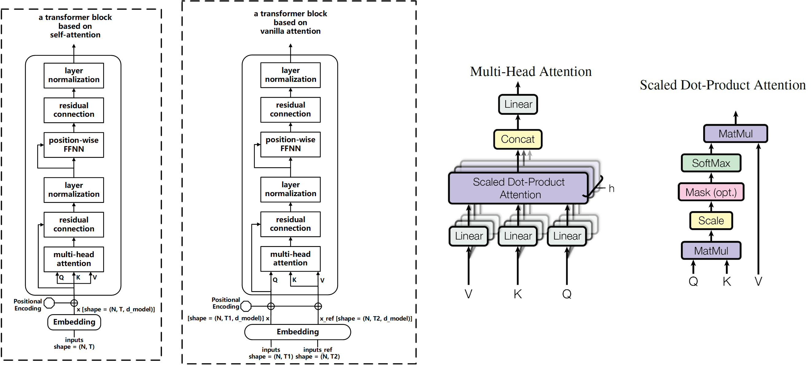

# [transformer] 核心 block 模块化

## Class TransformerVanillaBlock 参数说明：
### 1.  \_\_init\_\_
~~~
  def __init__(  
          self,  
          x_maxLen,  
          x_ref_maxLen=None,  
          d_model=512,  
          d_ff=512*4,  
          num_heads=8,  
          dropout_rate=0,  
          encode_type=0,  
          training=True,  
          first_block=True,  
  )
~~~
+ x_maxLen: 是序列 x 的最大序列长度
+ x_ref_maxLen: 是序列 x_ref 的最大序列长度
+ d_model: transformer block 中 linear 层维度 ，position-wise feed forward network 的输出维度， x 序列编码后的难度， d_model 应该与 x 的最后一个维度 (d_embed) 一致
+ d_ff: position-wise feed forward network 的隐藏层维度
+ num_heads: multi-head attention 的 head 数量
+ dropout_rate: 在 scaled dot product attention 中设置 dropout 的概率
+ encode_type: 设置 multi-head attention 的类型。  
  如果 encode_type 为 0 ，则表示是基于 self-attention ，即 Q=K=V=x ，此时 x_ref 和 x_ref_maxLen 不起作用。  
  如果 encode_type 为 1, ，则表示是基于 vanilla attention ，即 Q=x, K=V=x_ref 。
+ training: 代表此时创建的 transformer block 是用于训练，影响 block 中定义的 tf.layers.dropout
+ first_block: 代表此时创建的 transformer block 是否是 stacked blocks 中的第一个。  
  如果 first_block=True ，则对 x 或者 x_ref 进行 positional encoding 。  
  如果 first_block=False ，则不对 x 或者 x_ref 进行 positional encoding 。

### 2.  \_\_call\_\_
~~~
  def __call__(self, x, x_ref=None)
~~~
+ x: 要进行编码的序列 x ，x.shape = (N, T1, d_model)
+ x_ref: 用于基于 vanilla attention 的参考序列 x_ref ， x_ref.shape = (N, T2, d_model)

### Class TransformerVanillaBlock 算法流程
1. 输入序列 x ，[x_ref]
2. 如果是 first_block ，对 x ，[x_ref] 进行位置编码 (positional encoding)
3. 进行 multi-head attention 计算 (假设基于 self-attention, 即 Q=K=V=x)
    - 对 Q, K, V 进行 linear 映射到 d_model 的空间上，得到 Q_, K_, V_
    - 对 Q_, K_, V_ 分别划分为 num_heads 份，得 Q_mh, K_mh, V_mh
    - 进行 scaled dot product attention 的计算
      - Q_mh 和 K_mh 进行 dot product , scale
      - 对上面的计算结果进行基于 K_mh 的 masking 【目的：去除  K 方向的 \<pad\> 的影响】
      - 进行 softmax
      - 对上面的计算结果进行基于 Q_mh 的 masking 【目的：去除 Q 方向的 \<pad\> 的影响】
      - 对上面的计算结果进行 dropout
      - 将上面的计算结果与 V_mh 进行矩阵乘
    - 将 num_heads 份的计算结果进行 concat
    - 进行 linear 映射到 d_model 的空间
4. 对上面的计算结果与 Q 进行残差链接【由于这一步的操作，所以需要 x 的最后一个维度与 d_model 一致】
5. 进行 layer normalizing
6. 进行 position-wise feed forward
7. 对上面的计算结果与 Q 进行残差链接【由于这一步的操作，所以需要 x 的最后一个维度与 d_model 一致】
8. 进行 layer normalizing
9. 输出编码后的 x

## 示意图

[transformer]: http://papers.nips.cc/paper/7181-attention-is-all-you-need.pdf
